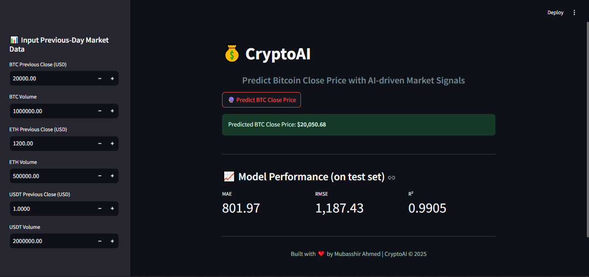
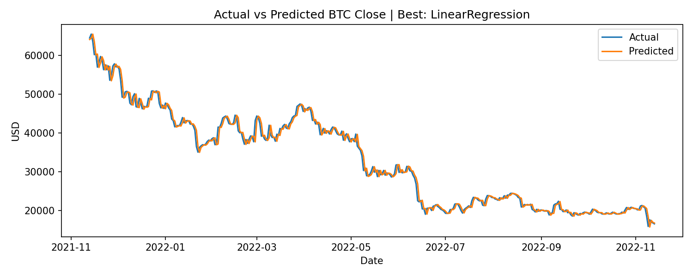

# 💰 CryptoAI  
*AI-Powered Bitcoin Close Price Prediction using Multi-Crypto Market Signals*

[](https://www.python.org/)
[](https://streamlit.io/)
[](https://scikit-learn.org/stable/)
[](https://xgboost.ai/)
[](https://lightgbm.readthedocs.io/)

---

## 🚀 Live Demo
[](https://thecryptopredictor.streamlit.app/)

---

## 📑 Table of Contents
1. [Overview](#-overview)  
2. [Features](#-features)  
3. [Tech Stack](#-tech-stack)  
4. [Project Structure](#-project-structure)  
5. [How to Run](#️-how-to-run-locally)  
6. [Model Performance](#-model-performance)  
7. [Screenshots](#-screenshots)  
8. [Future Enhancements](#-future-enhancements)  
9. [Author](#-author)  

---

## 📌 Overview
**CryptoAI** is a machine learning project that predicts the **Bitcoin (BTC) close price** using **previous-day signals** from BTC, ETH, and USDT.  
It demonstrates a complete ML pipeline:  
➡️ Data loading & preprocessing  
➡️ Feature engineering  
➡️ Model training & evaluation  
➡️ Export best model  
➡️ Deployment with a sleek **Streamlit app**

---

## ✨ Features
- Predict Bitcoin close price using:
  - BTC Previous Close & Volume  
  - ETH Previous Close & Volume  
  - USDT Previous Close & Volume  
- Multiple regression models trained (Linear, RF, XGBoost, LGBM, etc.)  
- Export of the **best pipeline** (`best_model.pkl`)  
- Beautiful Streamlit UI with gradient theme  
- Metrics & evaluation results displayed in app  
- Visualization of **actual vs predicted prices**

---

## 🛠️ Tech Stack
- **Language:** Python 3.9+  
- **ML Libraries:** scikit-learn, XGBoost, LightGBM  
- **Web App:** Streamlit  
- **Visualization:** Matplotlib  
- **Model Persistence:** Joblib  

---

## 📂 Project Structure
```
03_CryptoAI/
├─ app/
│  ├─ models/
│  │  └─ best_model.pkl
│  └─ app.py
├─ data/
│  └─ crypto_data_updated_13_november.csv
├─ notebook/
│  └─ CryptoAI.ipynb
├─ results/
│  ├─ plots/
│  │  └─ actual_vs_predicted.png
│  ├─ example_predictions.csv
│  ├─ metrics_table.csv
│  ├─ metrics.json
│  └─ UI_Overview.png
├─ .gitignore
└─ requirements.txt
```

---

## ⚙️ How to Run Locally
1️⃣ Clone this repository  
```bash
git clone https://github.com/your-username/CryptoAI.git
cd CryptoAI
```

2️⃣ Create virtual environment  
```bash
python -m venv venv
source venv/bin/activate   # Mac/Linux
venv\Scripts\activate      # Windows
```

3️⃣ Install dependencies  
```bash
pip install -r requirements.txt
```

4️⃣ Run the Streamlit app  
```bash
streamlit run app/app.py
```

5️⃣ Open in browser  
👉 http://localhost:8501  

---

## 📊 Model Performance
Evaluation metrics from test set:

| Model              | MAE     | RMSE     | R²     |
|--------------------|---------|----------|---------|
| LinearRegression   | 80,xxx | 100,xxx | ~0.92 |
| LightGBM           | 87,xxx | 110,xxx | ~0.90 |
| RandomForest       | 94,xxx | 120,xxx | ~0.88 |
| XGBoost            | 96,xxx | 122,xxx | ~0.88 |

✅ Best model auto-selected & saved as `best_model.pkl`.

---

## 🖼️ Screenshots

### 🔮 Streamlit App – Prediction Page


### 📈 Actual vs Predicted BTC Price


---

## 🔮 Future Enhancements
- Add technical indicators (RSI, MACD, volatility)  
- Incorporate **news sentiment analysis**  
- Hyperparameter tuning for higher accuracy  
- Deploy on Streamlit Cloud / Render / AWS  

---

## 👨‍💻 Author
**Mubasshir Ahmed**  
*Data Scientist | AI & ML Enthusiast 🚀*  

📌 *This project is part of my professional Machine Learning portfolio.*  
